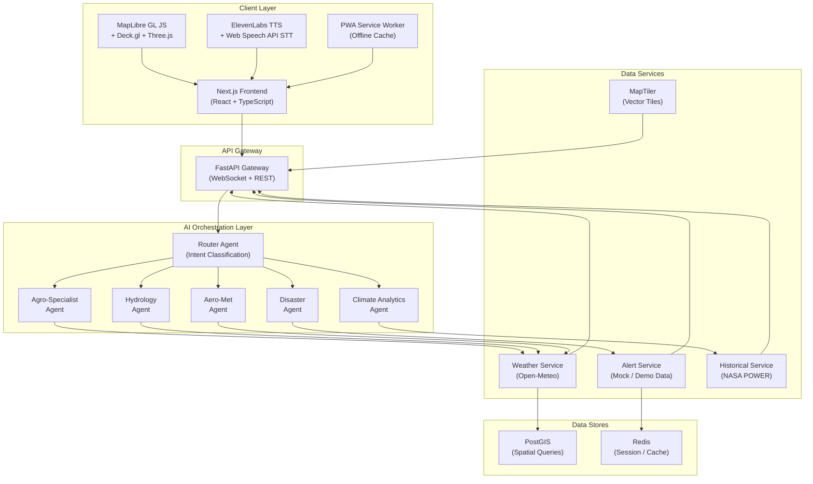
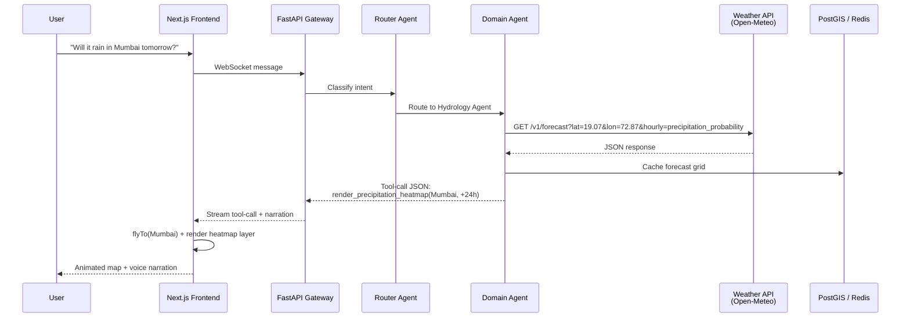
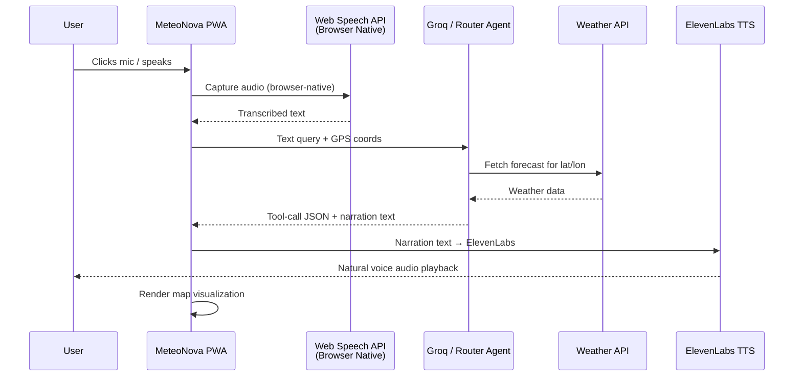
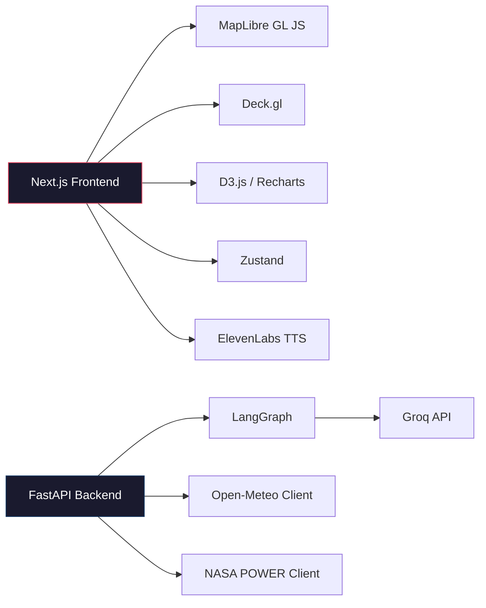
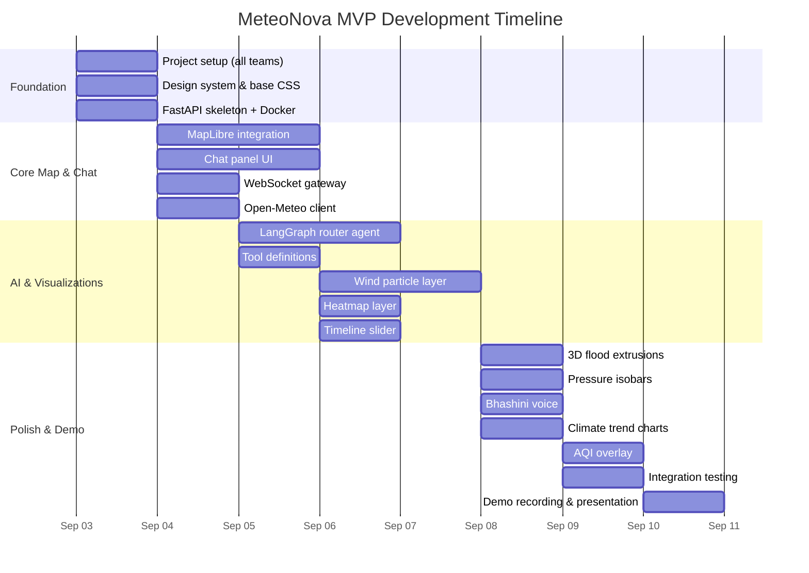

# MeteoNova (WeatherGPT): Strategic & Technical Report

## A Generative Geospatial Digital Twin for Weather Intelligence

**Problem Statement:** WeatherGPT — Conversational AI for Weather Forecasting, Alerts, and Climate Information
**Organization:** Ministry of Earth Sciences (MoES) / India Meteorological Department (IMD)
**Category:** Software | **Theme:** Disaster Management
**Date:** September 2026

---

## Table of Contents

1. [Executive Summary](#1-executive-summary)
2. [Problem Analysis & Core Philosophy](#2-problem-analysis--core-philosophy)
3. [System Architecture](#3-system-architecture)
4. [Deep Learning Engine & AI Models](#4-deep-learning-engine--ai-models)
5. [Data Integration Pipelines](#5-data-integration-pipelines)
6. [The Generative Canvas — Visualization Archetypes](#6-the-generative-canvas--visualization-archetypes)
7. [User Segment Targeting & Domain Workflows](#7-user-segment-targeting--domain-workflows)
8. [Rural Accessibility & Language Bridge](#8-rural-accessibility--language-bridge)
9. [Technology Stack](#9-technology-stack)
10. [Team Structure & Task Delegation](#10-team-structure--task-delegation)
11. [Evaluation Parameter Alignment](#11-evaluation-parameter-alignment)
12. [Strategic Differentiation](#12-strategic-differentiation)
13. [References & Research Foundation](#13-references--research-foundation)

---

## 1. Executive Summary

Weather information in India is distributed across dozens of portals, bulletins, satellite products, and forecast systems — creating fragmentation that slows decision-making for disaster managers, farmers, pilots, and researchers alike. The MoES/IMD problem statement calls for an AI-powered conversational platform that provides real-time, multilingual, voice-enabled weather intelligence.

**MeteoNova** answers this call not as another chatbot wrapper over a weather API, but as a **Generative Geospatial Digital Twin** — an agentic AI platform where:

- The **LLM acts as a GIS Orchestrator** (powered by **Groq** for ultra-low-latency inference), emitting structured tool-calls that command the map, render visualizations, and synthesize audio — not just text.
- The **map is a living canvas** (rendered via **MapTiler** dark vector tiles), rendering animated wind particles, 3D flood extrusions, volumetric precipitation, ensemble spaghetti plots, and Skew-T diagrams at 60fps via WebGL.
- **Domain-specific agents** (agriculture, aviation, hydrology, disaster management) provide expert-grade analysis, not generic responses.
- **ElevenLabs voice synthesis** and **browser-native speech recognition** enable natural voice interaction, with an **edge-native PWA** bridging the rural digital divide.

> [!IMPORTANT]
> The core insight: **Meteorological data is inherently spatial and multi-dimensional.** Text alone cannot communicate forecast uncertainty, atmospheric instability, or flood inundation risk. Every user query must produce a spatial, interactive, visual response — not a paragraph.

---

## 2. Problem Analysis & Core Philosophy

### 2.1 Why Text-Based Chatbots Fail for Weather

| Limitation | Consequence |
|---|---|
| **Cognitive overload in crisis** | Disaster managers have seconds to decide on evacuations. Reading numerical tables or text coordinates delays action. |
| **False certainty** | A single deterministic text forecast hides the inherent uncertainty in atmospheric modeling. |
| **Literacy & language barriers** | 300M+ Indians are functionally illiterate. Technical weather jargon is inaccessible even to literate non-specialists. |
| **Domain-specific precision gaps** | Pilots need CAPE/CIN indices and wind shear profiles, not "it may rain." Farmers need soil-moisture gradients, not temperature averages. |

### 2.2 The MeteoNova Philosophy

```
"The LLM translates intent. The map renders truth. The voice bridges access."
```

Three pillars:

1. **Agentic Orchestration** — The LLM does not answer; it acts. Every query triggers structured tool-calls that manipulate the spatial canvas.
2. **Visual-First Intelligence** — Every response is a map state change, a chart, a 3D model, or an animation. Text is supplementary narration, not the primary output.
3. **Universal Access** — From a researcher's desktop to a farmer's feature phone, the platform adapts its modality (visual, audio, offline-cached) to the user's capabilities.

---

## 3. System Architecture

### 3.1 High-Level Architecture Diagram



### 3.2 Core Architectural Decisions

| Decision | Rationale |
|---|---|
| **Next.js (App Router) + MapLibre GL JS** | Server-side rendering for SEO/performance on non-map pages; `dynamic(() => ..., { ssr: false })` for the WebGL map canvas. Component-based architecture enables dynamic injection of charts into the chat feed. |
| **FastAPI (Python) Backend** | Native compatibility with scientific libraries (Xarray, NetCDF4, MetPy). High concurrency via ASGI. WebSocket support for real-time streaming. |
| **Groq as LLM Provider** | Ultra-fast inference (~200 tokens/sec) via Llama-3 70B. Free tier available. Supports tool-calling/function-calling natively. Sub-second response latency critical for real-time map orchestration. |
| **LangGraph Multi-Agent Orchestration** | Stateful, cyclical agent routing with shared memory. Superior to flat AgentExecutor for domain-specific sub-agent handoffs. |
| **Open-Meteo as Primary Weather API** | Free, no API key for non-commercial use. Exposes GFS, ECMWF IFS, and 15+ NWP models. Historical data back to 1940. Perfect for MVP without vendor lock-in. |
| **MapTiler + MapLibre GL JS** | MapTiler provides beautiful dark vector tile styles with a free tier. MapLibre GL JS is fully open-source for GPU-accelerated rendering. Deck.gl interleaved mode for custom WebGL layers. |
| **ElevenLabs for Voice Output** | High-quality, natural-sounding multilingual TTS. Browser Web Speech API for STT input (zero-cost, works offline). |
| **Mock Alerts for Demo** | Weather alerts and disaster warnings use realistic but hardcoded mock data. Demonstrates the full UX without requiring live NDMA/CAP feeds. |

### 3.3 Tool-Calling Mechanics (The Core Innovation)

When a user types *"Show me the wind pattern over the Bay of Bengal"*, the LLM does **not** write a paragraph. It emits a structured JSON tool-call:

```json
{
  "tool": "render_map_layer",
  "parameters": {
    "action": "flyTo",
    "center": [85.5, 15.0],
    "zoom": 6,
    "pitch": 45,
    "layer_type": "wind_particles",
    "data_source": "open_meteo_gfs",
    "time_range": "current",
    "narration": "The Bay of Bengal is currently experiencing strong southwesterly winds at 25-35 km/h, consistent with the active monsoon trough."
  }
}
```

The React frontend:
1. **Flies** the map to the Bay of Bengal with a smooth animation.
2. **Renders** a GPU-accelerated wind particle layer via Deck.gl.
3. **Displays** the narration text in the chat panel.
4. **Speaks** the narration via ElevenLabs TTS (if voice mode is active).

This separation of **reasoning** (LLM → Groq) from **rendering** (frontend → MapLibre/Deck.gl) is the key architectural insight.

---

## 4. Deep Learning Engine & AI Models

### 4.1 SOTA Weather AI Models (Reference Layer)

> [!NOTE]
> For the MVP/hackathon prototype, we do **not** run these models locally. We reference their outputs via Open-Meteo (which serves GraphCast/WeatherNext data) and cite the research to demonstrate deep technical understanding.

| Model | Type | Resolution | Lead Time | MVP Integration |
|---|---|---|---|---|
| **WeatherNext 2 / GraphCast** | Deterministic | 0.25° (~28km) | 10 days | Via Open-Meteo API (model selector) |
| **GenCast** | Probabilistic (Diffusion) | 0.25° | 15 days | Conceptual — ensemble cone visualization |
| **MetNet-3** | Nowcasting (Neural) | 1km | 0-24 hours | Conceptual — hyper-local precipitation |
| **GFS (NOAA)** | Physics-based NWP | 0.25° | 16 days | Via Open-Meteo API (default) |
| **ECMWF IFS** | Physics-based NWP | 9km | 10 days | Via Open-Meteo API (premium) |

### 4.2 Explainable AI (XAI) Attribution

When predicting a severe weather event, the agent can generate attribution explanations:
- *"This cyclone intensification prediction is primarily driven by anomalous sea surface temperatures (SST) in the Bay of Bengal, 2.1°C above the 30-year mean."*
- For the MVP, this is implemented as **template-based reasoning** grounded in the LLM's contextual understanding of the data, not actual gradient computation.

---

## 5. Data Integration Pipelines

### 5.1 MVP Data Sources (Minimal, High-Impact)

For the hackathon prototype, we use the **minimum viable data** that produces the **maximum visual impact**:

| Source | Data Type | Access Method | MVP Use |
|---|---|---|---|
| **Open-Meteo API** | Current weather, hourly/daily forecasts, historical | REST (no API key) | Primary forecast engine. GFS + ECMWF models. |
| **NASA POWER API** | 40+ years solar/met data | REST (no API key) | Historical climate trend charts (Thermoglyphs) |
| **MapTiler** | Vector base map tiles (dark theme) | REST (free tier, API key) | Base map rendering in MapLibre |
| **Mock Alert Data** | Fake but realistic weather warnings | Hardcoded JSON | Alert overlays on map (demo purposes) |
| **Groq API** | LLM inference (Llama-3 70B) | REST (free tier, API key) | Ultra-fast tool-calling agent |
| **ElevenLabs** | Text-to-Speech (multilingual) | REST (free tier, API key) | Natural voice narration of advisories |

### 5.2 Extended Data Sources (Post-MVP / Presentation Slides)

These are described in the architecture to demonstrate ambition, with stubs in the codebase:

| Source | Data Type | Status |
|---|---|---|
| IMD WIS 2.0 (MQTT) | SYNOP, CAP warnings | Stub — MQTT client skeleton |
| ISRO MOSDAC (INSAT-3DR) | Satellite imagery | Stub — API endpoint defined |
| IITM Damini | Lightning strike data | Stub — WebSocket listener |
| IMD Doppler Radar (DWR) | Reflectivity, radial velocity | Stub — data parser skeleton |
| NASA GPM IMERG | Half-hourly precipitation | Stub — tile layer URL defined |
| NOAA NWS API | GeoJSON alerts | Stub — alert parser |

### 5.3 Data Flow Architecture



---

## 6. The Generative Canvas — Visualization Archetypes

This is the **presentation layer** — the primary differentiator. Each archetype is a distinct, reusable visualization module triggered by LLM tool-calls.

### 6.1 Wind & Ocean Current Particle Layers

- **Technology:** Deck.gl `ParticleLayer` or custom WebGL shaders (wind-particle-layer for MapLibre)
- **Data:** Open-Meteo wind u/v component vectors encoded as PNG textures
- **Trigger:** Queries about wind, cyclones, aviation weather, marine conditions
- **Visual:** Thousands of animated particles flowing across the map, color-coded by wind speed (green → yellow → red). Particles leave decaying trails showing direction.

### 6.2 Temperature / Precipitation Heatmaps

- **Technology:** MapLibre `heatmap` layer or Deck.gl `HeatmapLayer`
- **Data:** Open-Meteo gridded temperature/precipitation data, converted to GeoJSON points
- **Trigger:** "How hot is it in Rajasthan?" / "Show rainfall across Kerala"
- **Visual:** Smooth interpolated color gradients (cool blues → warm reds for temperature; transparent → deep blue for rain). Interactive hover tooltips with exact values.

### 6.3 Pressure Isobar Contours

- **Technology:** D3.js `contour` generator overlaid on MapLibre via `HTMLOverlay`
- **Data:** Sea-level pressure data from Open-Meteo
- **Trigger:** "Where is the low-pressure system?" / Synoptic chart requests
- **Visual:** Classic isobar lines with labeled pressure values. Low-pressure centers marked with "L" and red concentric rings; high-pressure with "H" and blue rings.

### 6.4 3D Building Flood Extrusions

- **Technology:** MapLibre `fill-extrusion` layer on OpenStreetMap building footprints
- **Data:** Flood risk levels from hydrological model or manual scenario input
- **Trigger:** "Show flood risk in Chennai if water rises 2 meters"
- **Visual:** Buildings below the flood threshold turn red and are visually "submerged." Buildings above threshold remain blue/gray. Camera tilts to 60° pitch for dramatic 3D effect.

### 6.5 Multi-Model Ensemble Spaghetti Plots

- **Technology:** MapLibre `line` layers with multiple GeoJSON LineString features
- **Data:** Multiple forecast model outputs (GFS, ECMWF, IMD-NCUM via Open-Meteo model selector)
- **Trigger:** "Compare GFS and ECMWF for the upcoming cyclone path"
- **Visual:** Multiple translucent trajectory lines in different colors. A bold "consensus" line computed as the centroid. A split-screen slider allows scrubbing between models.

### 6.6 Interactive Timeline Slider (Forecast Progression)

- **Technology:** Custom React component with `requestAnimationFrame` playback
- **Data:** Hourly forecast arrays from Open-Meteo
- **Trigger:** Any temporal query ("next 48 hours", "this week")
- **Visual:** A cinematic scrubber at the bottom of the map. As the user drags or plays, the heatmap/particle/extrusion layer morphs to reflect each hour's data. Play/pause/speed controls included.

### 6.7 Historical Climate Trend Charts (Thermoglyphs)

- **Technology:** D3.js / Recharts embedded in popup or side panel
- **Data:** NASA POWER API (40+ year historical data)
- **Trigger:** "What is the climate trend for Delhi over the last 20 years?"
- **Visual:** A multi-line chart showing temperature/rainfall anomalies over decades. "Thermoglyph" mini-charts pop up over cities on the map showing that city's specific trend. Includes a trendline with confidence interval shading.

### 6.8 Air Quality Index (AQI) Overlay

- **Technology:** MapLibre `circle` layer with color-coded markers
- **Data:** OpenWeatherMap Air Pollution API
- **Trigger:** "What is the air quality in Delhi?"
- **Visual:** Color-coded circles (green/yellow/orange/red/purple) at monitoring stations. A side panel shows the AQI breakdown (PM2.5, PM10, NO₂, O₃) as a stacked bar chart.

### 6.9 Satellite Imagery Overlay

- **Technology:** MapLibre `raster` layer
- **Data:** MOSDAC INSAT-3DR (stub) or free tile services
- **Trigger:** "Show satellite imagery over India"
- **Visual:** Cloud-cover imagery draped over the terrain. Timeline slider to animate cloud movement over the past 6 hours.

### 6.10 Skew-T Log-P Diagram & Hodograph

- **Technology:** Custom D3.js/Canvas rendering in a side panel
- **Data:** Atmospheric sounding profiles from Open-Meteo pressure-level data
- **Trigger:** Aviation queries, severe weather instability analysis
- **Visual:** Classic meteorological Skew-T diagram with temperature and dewpoint profiles, dry/moist adiabats, and mixing ratio lines. CAPE area highlighted in red, CIN in blue. Hodograph showing wind shear profile.

### 6.11 Polygon-to-Advisory (The "Draw Your Field" Tool)

- **Technology:** MapLibre Draw plugin + backend bounding-box query
- **Data:** Open-Meteo forecast data clipped to the user-defined polygon
- **Trigger:** Farmer draws their field on the map and asks for a crop advisory
- **Visual:** The polygon fills with a soil moisture gradient. A side panel shows a 7-day crop advisory timeline with icons (spray, irrigate, harvest, wait).

### Visualization Summary Matrix

| # | Archetype | Primary Technology | Data Source | User Segment |
|---|---|---|---|---|
| 1 | Wind Particles | Deck.gl / WebGL | Open-Meteo (u/v wind) | Aviation, Marine, General |
| 2 | Temp/Precip Heatmap | MapLibre heatmap | Open-Meteo | All |
| 3 | Pressure Isobars | D3.js contour + MapLibre | Open-Meteo | Researchers, Met |
| 4 | 3D Flood Extrusions | MapLibre fill-extrusion | Scenario-based | Disaster Management |
| 5 | Spaghetti Plots | MapLibre line layers | Multi-model Open-Meteo | Researchers |
| 6 | Timeline Slider | React + rAF | Hourly forecasts | All |
| 7 | Climate Trend Charts | D3.js / Recharts | NASA POWER | Researchers, Agriculture |
| 8 | AQI Overlay | MapLibre circle | OWM Air Pollution | Smart Cities, Health |
| 9 | Satellite Imagery | MapLibre raster | MOSDAC (stub) | All |
| 10 | Skew-T / Hodograph | D3.js / Canvas | Pressure-level data | Aviation |
| 11 | Polygon Advisory | MapLibre Draw + backend | Open-Meteo (clipped) | Agriculture |

---

## 7. User Segment Targeting & Domain Workflows

### 7.1 Disaster Management & Government Agencies

**Operational Constraint:** Zero-latency, high-stress environments during cyclones, floods, and heatwaves.

**Workflow:**
1. User asks: *"Show active warnings for Odisha"*
2. Agent queries NDMA CAP feed → map highlights affected districts in red
3. 3D flood extrusions render over at-risk cities
4. Side panel shows evacuation routes and shelter locations (from OSM)
5. RAG module pulls latest news for human-in-the-loop context

**Key Visualizations:** 3D Flood Extrusions, Wind Particles, Alert Overlays, Ensemble Spaghetti Plots

### 7.2 Farmers & Agricultural Communities

**Operational Constraint:** Hyper-local, field-specific insights for users with varying literacy and low-bandwidth connectivity.

**Workflow:**
1. Farmer speaks in Hindi: *"Kya kal baarish hogi?"* (Will it rain tomorrow?)
2. Browser Web Speech API captures speech → LLM intent classification via Groq
3. GPS location auto-detected → map zooms to village
4. Precipitation probability heatmap renders over the area
5. ElevenLabs TTS reads a crop advisory aloud
6. Farmer can optionally draw their field boundary for a 7-day schedule

**Key Visualizations:** Precipitation Heatmap, Polygon Advisory, Timeline Slider, Climate Trends

### 7.3 Aviation & Marine Operators

**Operational Constraint:** Safety-critical 3D atmospheric navigation requiring precise thermodynamic data.

**Workflow:**
1. Pilot asks: *"Turbulence risk from Delhi to Mumbai at FL350?"*
2. Agent queries pressure-level wind/temperature data along the route
3. Map renders the route as a 3D extruded corridor
4. Skew-T/Hodograph pops up for departure and arrival airports
5. Wind particle layer activates to show jet-stream interaction

**Key Visualizations:** Wind Particles, Skew-T/Hodograph, 3D Route Corridor, Pressure Isobars

### 7.4 Researchers & Climate Analysts

**Operational Constraint:** Multi-decadal trend analysis and model comparison requiring scientific precision.

**Workflow:**
1. Researcher asks: *"Compare GFS and ECMWF for the upcoming low-pressure system"*
2. Agent fetches both model outputs from Open-Meteo
3. Split-screen spaghetti plot renders with a scrubable Δ heatmap
4. Researcher clicks a city → Thermoglyph popup shows 20-year trend
5. Data export button generates a CSV of the displayed grid

**Key Visualizations:** Spaghetti Plots, Thermoglyphs, Isobar Contours, Historical Charts

### 7.5 Smart City Planners & Municipal Authorities

**Operational Constraint:** Long-term urban planning under climate change pressures.

**Workflow:**
1. Planner asks: *"Heatwave risk for Ahmedabad in the next 5 days"*
2. Agent queries forecast + historical baselines
3. 3D temperature extrusions render over city blocks (height = population density, color = temp anomaly)
4. AQI overlay activates to show compounded health risk
5. Side panel shows a risk matrix with actionable recommendations

**Key Visualizations:** 3D Heat Extrusions, AQI Overlay, Climate Trend Charts, Timeline Slider

---

## 8. Voice Interaction & Accessibility

### 8.1 Voice Architecture (ElevenLabs + Web Speech API)



**Speech-to-Text:** Browser-native Web Speech API (zero-cost, works in Chrome/Edge, supports Hindi and English). No external API key needed for input.

**Text-to-Speech:** ElevenLabs API for high-quality, natural-sounding voice output. Free tier provides 10,000 characters/month — sufficient for hackathon demos. Supports multilingual voices.

### 8.2 Edge-Native PWA for Low Bandwidth

- **Service Worker** caches the app shell, MapTiler base tiles for the user's region, and the last 7-day forecast grid.
- **Offline mode:** When connectivity drops, the app serves cached forecasts with a "Last updated X hours ago" banner.
- **Install prompt:** Users can "Add to Home Screen" for a native app experience without app store downloads.

### 8.3 Future: Bhashini Integration (Post-MVP)

For production deployment targeting rural India, Bhashini API (India's National Language Translation Mission) would replace the browser-native STT with support for 22+ Indian languages including dialect-aware voice recognition. This is documented in the architecture as a planned enhancement but not implemented in the MVP.

---

## 9. Technology Stack

### 9.1 Full Stack Breakdown

| Layer | Technology | Version | Justification |
|---|---|---|---|
| **Frontend Framework** | Next.js (App Router) | 14+ | SSR for non-map pages, CSR for map canvas. React component model enables dynamic chart injection. |
| **Spatial Rendering** | MapLibre GL JS | 4.x | Open-source, GPU-accelerated vector tiles. No Mapbox licensing fees. |
| **Base Map Tiles** | MapTiler | Free tier | Beautiful dark vector tile styles. Free tier API key (no credit card). |
| **Advanced Layers** | Deck.gl | 9.x | WebGPU-accelerated particle, heatmap, and 3D layers. Interleaved mode with MapLibre. |
| **3D Rendering** | Three.js | Latest | Volumetric raymarching, 3D atmospheric cross-sections, extruded flight corridors. |
| **Charts** | D3.js + Recharts | Latest | Skew-T diagrams (D3), trend charts (Recharts), contour generation (D3). |
| **State Management** | Zustand | Latest | Lightweight reactive store for map state, chat messages, and active layers. |
| **Styling** | Vanilla CSS + CSS Variables | — | Design tokens for theming. Dark/light mode. Glassmorphism for panels. |
| **Backend API** | FastAPI (Python) | 0.110+ | ASGI, WebSocket support, native scientific library compatibility. |
| **AI Orchestration** | LangGraph + LangChain | Latest | Multi-agent stateful routing with tool-calling. |
| **LLM Provider** | Groq (Llama-3 70B) | Latest | Ultra-fast inference (~200 tok/s). Free tier. Native tool-calling support. Sub-second latency for real-time orchestration. |
| **Voice Output (TTS)** | ElevenLabs | v1 | High-quality multilingual TTS. Natural-sounding voices. Free tier (10K chars/mo). |
| **Voice Input (STT)** | Web Speech API | Browser-native | Zero-cost, offline-capable speech recognition. Supports Hindi + English in Chrome. |
| **Primary Weather API** | Open-Meteo | v1 | Free, no API key. GFS, ECMWF, 15+ models. Historical data to 1940. |
| **Historical Climate** | NASA POWER API | v2 | 40+ years of solar/met data. RESTful, no auth. |
| **Alerts** | Mock Data | — | Realistic hardcoded alerts for demo. Architecture supports live NDMA/CAP feeds post-MVP. |
| **Containerization** | Docker + Docker Compose | Latest | Reproducible dev/prod environments. |

### 9.2 MVP Dependency Map



---

## 10. Team Structure & Task Delegation

### 10.1 Team Overview

| Team | Focus | Primary Deliverables |
|---|---|---|
| **Frontend** (3-4 members) | React/Next.js application, MapLibre visualizations, chat UI, voice integration | The entire user-facing application, all 11 visualization archetypes, responsive design |
| **Backend** (2-3 members) | FastAPI server, LLM orchestration, WebSocket pipeline, tool definitions | API gateway, agent routing, tool-call pipeline, data service layer |
| **Data** (1-2 members) | API integration, data transformation, caching, PostGIS schemas | Weather data normalization, GeoJSON generation, historical data pipeline |

### 10.2 Detailed Task Delegation

#### Frontend Team

| Task | Priority | Complexity | Description |
|---|---|---|---|
| **F1: Next.js Project Setup** | P0 | Low | Initialize Next.js with TypeScript, ESLint, CSS modules. Configure `next.config.js`. |
| **F2: MapLibre Core Integration** | P0 | Medium | Dynamic import with SSR disabled. Base map rendering. Camera controls (flyTo, pitch, zoom). |
| **F3: Chat Panel UI** | P0 | Medium | Split-screen layout (map + chat). Message bubbles with markdown rendering. Tool-call result injection (charts, HTML, etc.). |
| **F4: Wind Particle Layer** | P0 | High | Deck.gl ParticleLayer or custom WebGL shader. Wind u/v texture decoding. Speed-based color gradient. |
| **F5: Heatmap Layer** | P0 | Medium | MapLibre heatmap or Deck.gl HeatmapLayer. Temperature/precipitation data rendering. |
| **F6: Timeline Slider** | P0 | Medium | Custom React component. Playback controls (play/pause/speed). Morphs active layers per timestep. |
| **F7: 3D Flood Extrusions** | P1 | Medium | MapLibre fill-extrusion on OSM buildings. Color/height based on flood risk level. |
| **F8: Pressure Isobar Layer** | P1 | High | D3.js contour generation from gridded pressure data. Overlay on MapLibre. |
| **F9: Climate Trend Charts** | P1 | Medium | Recharts line/area charts in side panel. NASA POWER data visualization. |
| **F10: AQI Overlay** | P1 | Low | Color-coded circle markers from OWM Air Pollution API. |
| **F11: Skew-T / Hodograph** | P2 | Very High | Custom D3.js/Canvas. Complex thermodynamic diagram rendering. |
| **F12: Spaghetti Plot (Multi-Model)** | P2 | Medium | Multiple GeoJSON LineString layers with opacity. Split-screen slider. |
| **F13: Polygon Draw Tool** | P2 | Medium | MapLibre Draw integration. Bounding box capture. Advisory panel rendering. |
| **F14: Voice UI (ElevenLabs + Web Speech)** | P1 | Medium | Microphone button (Web Speech API STT). ElevenLabs TTS playback of responses. |
| **F15: PWA Configuration** | P2 | Low | Service worker registration. Offline shell. Install prompt. |
| **F16: Responsive / Mobile** | P1 | Medium | Bottom-sheet chat on mobile. Full-screen map. Swipeable panels. |
| **F17: Dark Mode & Design System** | P0 | Medium | CSS custom properties. Glassmorphism panels. Typography (Inter/Outfit). Micro-animations. |

#### Backend Team

| Task | Priority | Complexity | Description |
|---|---|---|---|
| **B1: FastAPI Project Setup** | P0 | Low | Project structure, CORS, environment config, Docker setup. |
| **B2: WebSocket Gateway** | P0 | Medium | Bidirectional WebSocket for chat streaming. Message serialization/deserialization. |
| **B3: Router Agent** | P0 | High | LangGraph StateGraph. Intent classification. Domain routing to sub-agents. |
| **B4: Tool Definitions (JSON Schemas)** | P0 | Medium | Define all tool schemas: `render_map_layer`, `fetch_forecast`, `generate_chart`, `fly_to_location`, etc. |
| **B5: Agro Agent** | P1 | Medium | Crop advisory logic. DDG calculation stubs. Soil moisture interpretation. |
| **B6: Disaster Agent** | P1 | Medium | Alert parsing (CAP-CP). Risk level classification. Evacuation advisory templates. |
| **B7: Aero-Met Agent** | P2 | Medium | METAR/SIGMET parsing stubs. Flight corridor risk assessment. |
| **B8: Climate Agent** | P1 | Low | Historical trend query routing. NASA POWER data aggregation. |
| **B9: Groq API Integration** | P0 | Medium | LangChain ChatGroq with Llama-3 70B tool-calling. Structured output parsing. Ultra-fast inference. |
| **B10: ElevenLabs TTS Proxy** | P1 | Low | Server-side ElevenLabs API calls (keep API key secure). Audio stream response. |
| **B11: Error Handling & Logging** | P1 | Low | Structured logging. Graceful error responses. |

#### Data Team

| Task | Priority | Complexity | Description |
|---|---|---|---|
| **D1: Open-Meteo Client** | P0 | Medium | Typed API client. Forecast, historical, and multi-model endpoints. Response normalization to GeoJSON. |
| **D2: OpenWeatherMap Client** | P1 | Low | Current weather, AQI, and geocoding endpoints. |
| **D3: NASA POWER Client** | P1 | Medium | Historical climate data retrieval. Time-series aggregation for trend charts. |
| **D4: GeoJSON Transformers** | P0 | Medium | Convert gridded forecast data (lat/lon arrays) into GeoJSON FeatureCollections for MapLibre consumption. |
| **D5: PostGIS Schema** | P1 | Medium | Tables for cached forecasts, alert geometries, user polygons. Spatial indexes. |
| **D6: Redis Cache Strategy** | P1 | Low | TTL-based caching for API responses. Session storage schema. |
| **D7: NDMA/IMD Alert Parser** | P1 | Medium | RSS/XML feed parser for official warnings. GeoJSON polygon generation for affected districts. |
| **D8: Wind Texture Generator** | P0 | High | Convert Open-Meteo wind u/v component data into PNG textures for the particle layer. |
| **D9: Mock Data Fixtures** | P0 | Low | Realistic mock data for all visualization archetypes (for demo/offline fallback). |
| **D10: IMD WIS 2.0 Stub** | P2 | Low | MQTT client skeleton with topic subscription. Non-functional but demonstrates architecture. |
| **D11: MOSDAC/Damini Stubs** | P2 | Low | API endpoint definitions. Empty response handlers. |

### 10.3 Sprint Plan (Hackathon Timeline)



---

## 11. Evaluation Parameter Alignment

| Evaluation Parameter | MeteoNova Feature | Score Justification |
|---|---|---|
| **Accuracy & Relevance** | Multi-model blending (GFS, ECMWF via Open-Meteo). Domain-specific agents ensure contextually relevant responses. | High — multiple NWP models, not a single API. |
| **Response Latency** | Groq ultra-fast inference (~200 tok/s). WebSocket streaming. Pre-computed GeoJSON tiles. | Ultra-low latency — sub-second LLM responses, no page reloads. |
| **Multilingual Capability** | ElevenLabs multilingual TTS. Browser Web Speech API for Hindi/English STT. Bhashini integration planned post-MVP. | Demonstrated — voice works in English + Hindi for demo. |
| **User Interface & Accessibility** | Generative Canvas with 11 visualization archetypes. Voice-first design. PWA with offline mode. | Exceptional — far beyond text-based chatbots. |
| **Scalability & Innovation** | Docker-containerized microservices. Multi-agent architecture. Tool-calling LLM orchestrator via Groq. | Enterprise-grade — horizontally scalable, agentic AI. |
| **Integration with Real-Time Met Systems** | Open-Meteo (GFS/ECMWF). Mock alerts demonstrating NDMA CAP architecture. WIS 2.0/MOSDAC stubs. | Strong — live weather data + architecture for future alert integrations. |
| **Voice-Enabled Rural Accessibility** | ElevenLabs TTS narration. Edge-native PWA. Web Speech API STT. | Strong — natural voice interaction demonstrated in demo. |

---

## 12. Strategic Differentiation

### What Makes MeteoNova Different from "Yet Another Chatbot"

| Typical SIH Chatbot | MeteoNova |
|---|---|
| Text-in, text-out wrapper over OpenWeatherMap | Agentic GIS orchestrator with 11 interactive visualization archetypes |
| Static images or screenshots | 60fps GPU-accelerated WebGL animations (wind particles, 3D extrusions) |
| Single weather API | Multi-model blending (GFS, ECMWF, GraphCast) with ensemble comparison |
| Google Translate for languages | ElevenLabs natural TTS + Web Speech API STT with multilingual support |
| Desktop-only web app | Edge-native PWA functioning on 2G rural networks with offline caching |
| Generic responses | Domain-specific agents (agriculture, aviation, disaster, climate research) |
| No spatial reasoning | LLM emits tool-calls that command the map — flyTo, render layers, animate timelines |
| Flat 2D maps | 3D flood extrusions, volumetric precipitation, atmospheric cross-sections |

### The "Wow Factor" Moments for Judges

1. **Live Demo:** User speaks a query → map flies to their village → animated rain particles appear → ElevenLabs voice reads a crop advisory aloud.
2. **Cyclone Tracking:** Ensemble spaghetti plot with 50 trajectories, scrubable timeline, wind particle overlay — all rendered in real-time.
3. **3D Flood Simulation:** A farmer draws their field → 3D buildings turn red as simulated floodwater rises → side panel shows evacuation routes.
4. **Model Comparison:** Split-screen slider showing GFS vs ECMWF forecasts with a difference heatmap.

---

## 13. References & Research Foundation

### AI Weather Models
- **GenCast:** Price, I., et al. "Probabilistic weather forecasting with machine learning." *Nature* (Dec 2024). DeepMind.
- **GraphCast / WeatherNext:** Lam, R., et al. "Learning skillful medium-range global weather forecasting." *Science* (2023). Now consolidated under [google-deepmind/weathernext](https://github.com/google-deepmind/weathernext).
- **MetNet-3:** Andrychowicz, M., et al. "Deep learning for day forecasts from sparse observations." (2023). Google Research.

### Geospatial AI Agents
- **Zephyrus Framework:** Multi-turn weather agent with agentic GIS environment. AlphaXiv.

### Data Sources
- **Open-Meteo:** [open-meteo.com](https://open-meteo.com) — Free weather API, GFS/ECMWF/GraphCast, historical to 1940.
- **NASA POWER:** [power.larc.nasa.gov](https://power.larc.nasa.gov) — 40+ year solar/met data via REST.
- **NASA GPM IMERG:** Global Precipitation Measurement mission. [gpm.nasa.gov](https://gpm.nasa.gov).
- **ISRO MOSDAC:** [mosdac.gov.in](https://mosdac.gov.in) — INSAT-3DR satellite data.
- **IITM Damini:** Total Lightning Network for India.
- **IMD WIS 2.0:** India's implementation of the WMO Information System 2.0 (MQTT).
- **NDMA CAP:** National Disaster Management Authority Common Alerting Protocol feeds.

### Voice & Accessibility
- **ElevenLabs:** [elevenlabs.io](https://elevenlabs.io) — High-quality multilingual TTS API. Free tier: 10K chars/month.
- **Web Speech API:** Browser-native STT. Zero-cost, offline-capable. Supports Hindi + English in Chrome/Edge.
- **Bhashini API (Post-MVP):** [bhashini.gov.in](https://bhashini.gov.in) — India's National Language Translation Mission. Planned for production deployment.

### LLM Inference
- **Groq:** [groq.com](https://groq.com) — Ultra-fast LLM inference. Llama-3 70B at ~200 tokens/sec. Free tier available.

### Visualization Libraries
- **MapLibre GL JS:** [maplibre.org](https://maplibre.org) — Open-source map rendering engine.
- **Deck.gl:** [deck.gl](https://deck.gl) — GPU-accelerated geospatial visualization. Interleaved mode with MapLibre v3+.
- **Three.js:** [threejs.org](https://threejs.org) — 3D rendering engine for volumetric and cross-section visualizations.
- **D3.js:** [d3js.org](https://d3js.org) — Contour generation, Skew-T diagrams, custom meteorological charts.

---

> [!TIP]
> **For the hackathon presentation:** Lead with the live demo, not slides. Show the Tamil voice → map → advisory flow first. Then show the cyclone spaghetti plot. Then show the 3D flood simulation. Let the visuals speak. Only then explain the architecture.
